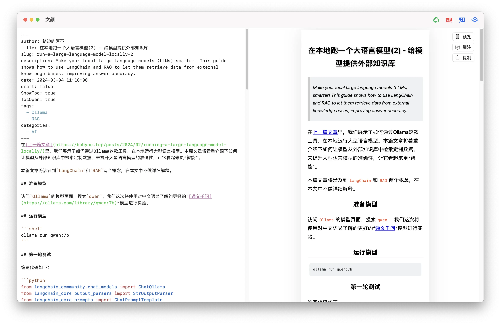

    

# 文颜

本项目的起源是我平常使用`markdown`写文章，再使用`hugo`生成静态页面发布到我的博客。但当我想把文章发布到诸如“公众号”、“知乎”、“今日头条”等平台时，发现需要针对每个平台进行格式转换，这会让我每次浪费很多时间。

后来我找到了 [Markdown Editor](https://markdown.com.cn/editor/) 网站，确实能很好的解决这些问题。但毕竟这是一个在线网站，我希望有个离线也能使用的工具，且我最近也在学`swift`，因此本项目应运而生。

## 功能

本项目的核心功能是将编辑好的`markdown`文章转换成适配各个发布平台的格式，通过一键复制，可以直接粘贴到平台的文本编辑器，无需再做额外调整。

- 支持发布到多平台：公众号、知乎、今日头条、掘金等
- 支持代码高亮
- 支持公式
- 支持链接转脚注
- 支持识别`front matter`语法
- 即将支持：公众号主题样式模版
- 即将支持：公众号自定义样式

题外话：在目前已支持的平台中，实际上只有“公众号”可以支持自定义样式，其它平台都只能使用平台预定义的样式。

## 应用截图

## 下载

本项目已上架`App Store`，你可以直接点击下方链接或搜索“文颜”下载：

`Windows`版下载：

[文颜](https://yuzhi.tech/wenyan)